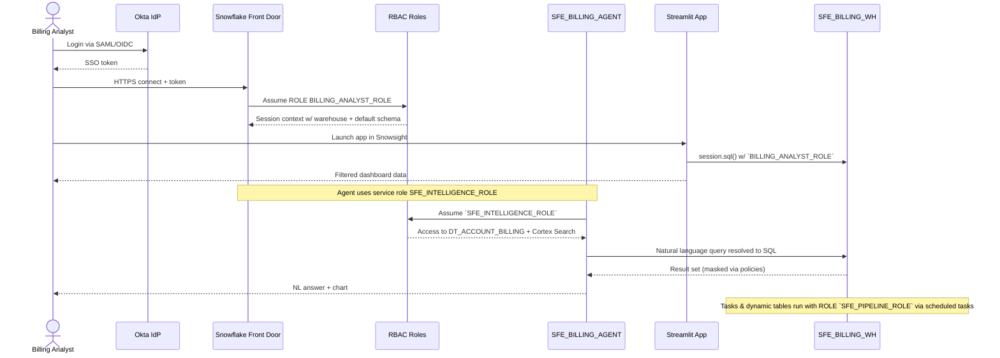

# Auth Flow - YouSoundGreat Billing Intelligence
Author: Michael Whitaker
Last Updated: 2025-11-18
Status: Reference Impl

Reference Impl: This code demonstrates prod-grade architectural patterns and best practice. review and customize security, networking, logic for your organization's specific requirements before deployment.
## Overview
Authentication and authorization sequence for analysts, automation tasks, and AI services accessing billing data with Snowflake-native RBAC.
## Diagram

## Component Descriptions
- Purpose: `BILLING_ANALYST_ROLE` grants read-only access to analytics schemas and Streamlit usage.
  - Technology: Snowflake RBAC role with warehouse usage.
  - Location: `sql/01_setup/03_create_roles.sql`
  - Deps: `SFE_BILLING_WH`, schema usage grants.
- Purpose: `SFE_INTELLIGENCE_ROLE` runs the Snowflake Intelligence agent with limited access to curated datasets.
  - Technology: Role + semantic model privileges.
  - Location: `sql/04_cortex/03_intelligence_agent.sql`
  - Deps: `DT_ACCOUNT_BILLING`, Cortex Search service, masking policies.
- Purpose: `SFE_PIPELINE_ROLE` executes tasks, streams, and dynamic table refreshes without analyst access.
  - Technology: Role + warehouse + monitor config.
  - Location: `sql/03_transformations/03_create_tasks.sql`
  - Deps: `SFE_BILLING_WH`, `SFE_RAW_BILLING` schemas.
## Change History
See `.cursor/DIAGRAM_CHANGELOG.md` for vhistory.
