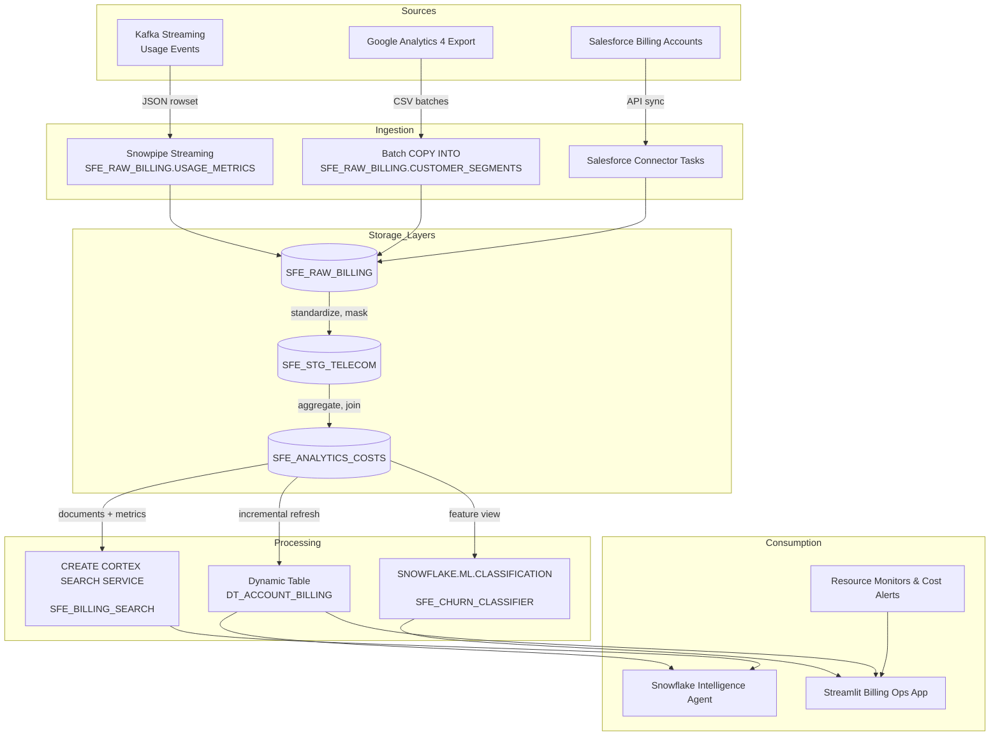

# Data Flow - YouSoundGreat Billing Intelligence
Author: SE Community  
Last Updated: 2025-11-21  
Expires: 2025-12-21 (30 days from creation)  
Status: Reference Implementation

Reference Implementation: This code demonstrates production-grade architectural patterns and best practices. Review and customize security, networking, and logic for your organization's specific requirements before deployment.
## Overview
End-to-end movement of telecom billing data from Kafka streams and SaaS sources through Snowflake ingestion, transformation, Cortex AI enrichment, and consumption channels (Snowflake Intelligence, Streamlit dashboards, APIs).
## Diagram

## Component Descriptions
- Purpose: Snowpipe Streaming for Kafka writes billing usage into `SFE_RAW_BILLING.USAGE_METRICS` within seconds.
  - Technology: Snowpipe Streaming INGEST API + Kafka connector.
  - Location: `sql/02_data/02_load_sample_data.sql`
  - Deps: Kafka topic, `SFE_BILLING_WH`.
- Purpose: Dynamic table `SFE_ANALYTICS_COSTS.DT_ACCOUNT_BILLING` keeps aggregates <15 min old for AI agents.
  - Technology: `CREATE DYNAMIC TABLE ... TARGET_LAG = '15 minutes'`.
  - Location: `sql/03_transformations/03_create_tasks.sql`
  - Deps: `FCT_ACCOUNT_COSTS`, warehouse `SFE_BILLING_WH`.
- Purpose: Cortex Search service `SFE_BILLING_SEARCH` powers semantic lookup of billing policies.
  - Technology: `CREATE CORTEX SEARCH SERVICE ... EMBEDDING_MODEL = 'snowflake-arctic-embed-m-v1.5'`.
  - Location: `sql/04_cortex/02_cortex_search.sql`
  - Deps: staged documentation table, `SFE_BILLING_WH`.
- Purpose: Snowflake Intelligence Agent `SFE_BILLING_AGENT` provides NL cost queries.
  - Technology: Snowflake Intelligence / Cortex Analyst agent config referencing semantic models + search.
  - Location: `sql/04_cortex/03_intelligence_agent.sql`
  - Deps: `DT_ACCOUNT_BILLING`, `SFE_BILLING_SEARCH`, cost warehouse.
## Change History
See `.cursor/DIAGRAM_CHANGELOG.md` for vhistory.
