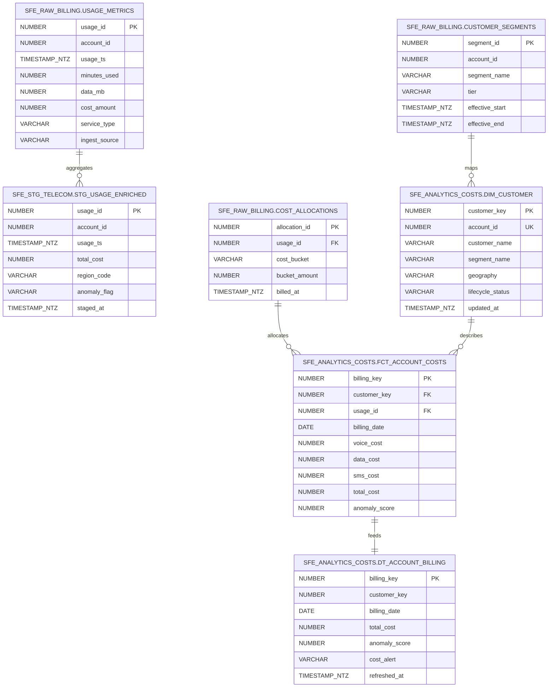

# Data Model - YouSoundGreat Billing Intelligence
Author: SE Community  
Last Updated: 2025-11-21  
Expires: 2025-12-21 (30 days from creation)  
Status: Reference Implementation

Reference Implementation: This code demonstrates production-grade architectural patterns and best practices. Review and customize security, networking, and logic for your organization's specific requirements before deployment.
## Overview
Logical data model for the TelecomCorp billing intelligence demo showing how raw usage feeds staging, analytics, Cortex-ready datasets, and governance tables inside `SNOWFLAKE_EXAMPLE`.
## Diagram

## Component Descriptions
- Purpose: `SFE_RAW_BILLING.USAGE_METRICS` captures unprocessed usage from Kafka/Snowpipe streaming.
  - Technology: Snowflake permanent table with ingestion from Snowpipe Streaming.
  - Location: `sql/02_data/01_create_tables.sql`
  - Deps: Kafka connector, `SFE_BILLING_WH`
- Purpose: `SFE_STG_TELECOM.STG_USAGE_ENRICHED` standardizes usage units and tags anomalies for ML.
  - Technology: SQL transformations + dynamic table refresh.
  - Location: `sql/03_transformations/02_create_views.sql`
  - Deps: `SFE_RAW_BILLING` tables, masking policies.
- Purpose: `SFE_ANALYTICS_COSTS.FCT_ACCOUNT_COSTS` is the curated billing fact powering Cortex ML & dashboards.
  - Technology: Snowflake analytic table refreshed via tasks.
  - Location: `sql/03_transformations/01_create_streams.sql`
  - Deps: staging view, `SFE_ANALYTICS_COSTS.DIM_CUSTOMER`.
- Purpose: `SFE_ANALYTICS_COSTS.DT_ACCOUNT_BILLING` surfaces ready-to-query aggregates for Snowflake Intelligence.
  - Technology: Dynamic table with `TARGET_LAG = '15 minutes'`.
  - Location: `sql/03_transformations/02_create_views.sql`
  - Deps: `SFE_BILLING_WH`, `FCT_ACCOUNT_COSTS`.
## Change History
See `.cursor/DIAGRAM_CHANGELOG.md` for vhistory.
